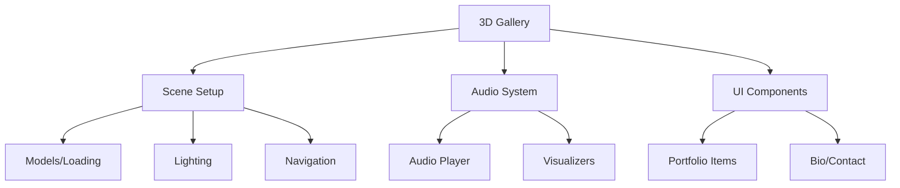

# Electronic Music Portfolio Website Plan

## Technology Stack Selection
### 3D Framework
- **Three.js**: Recommended starting point
  - Pros: Large community, good documentation, simpler API
  - Cons: Limited advanced features
- **Babylon.js**: Alternative for advanced needs
  - Pros: Physics, VR/AR support
  - Cons: Steeper learning curve

### Audio Visualization
- **Tone.js**: For audio processing and playback
- **p5.js**: For creative visualizations
- **Web Audio API**: Direct control when needed

### Frontend Framework
- **Next.js** (Recommended)
  - SSR/SSG benefits for SEO
  - Excellent Vercel integration
- **SvelteKit** (Alternative)
  - Better performance
  - Simpler state management

## Implementation Phases

### Phase 1: Core Functionality
1. Set up Three.js scene
2. Basic audio player integration
3. Simple visualization prototype
4. Scene navigation controls

### Phase 2: Portfolio Features
1. Content loading system
2. Project display components
3. Bio/contact section

### Phase 3: Polish
1. Performance optimization
2. Responsive design
3. Accessibility features
4. Cross-browser testing

## Architecture

## Progress Tracking
- [ ] Phase 1 started
- [ ] Phase 1 completed
- [ ] Phase 2 started
- [ ] Phase 2 completed
- [ ] Phase 3 started
- [ ] Phase 3 completed